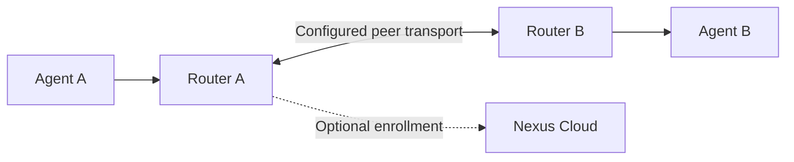

<div align="center">

# Nexus OpenWrt

**Give your Agents a network.**

[](LICENSE)
[](docs/user/en/index.md)
[](#citation)
[](https://github.com/Nexilume-AI/nexus-openwrt/actions/workflows/ci.yml)

`OpenWrt` · `LuCI` · `Edge routing`

**English** · [Chinese](README_zh.md)

[Highlights](#highlights) · [Quick start](#quick-start) · [Documentation](#documentation) · [Ecosystem](#ecosystem) · [Contributing](#contributing) · [Citation](#citation)

</div>

Agent registration, discovery and capability routing on OpenWrt, with a LuCI workspace, Cloud connectivity and optional self-hosted Relay / Directory.


*Workflow illustration, not a product screenshot. Connections require the setup and authorization described below.*

## Highlights

| Capability | What it provides |
| --- | --- |
| **Agent services** | LAN registration and callable capabilities |
| **Router network** | Neighbor discovery and capability routes across configured peers |
| **LuCI workspace** | User mode for daily operation; Developer mode for diagnostics |
| **Cloud connectivity** | Enrollment and configured Direct IPv6 / Cloud Relay transport |
| **Optional seed roles** | Self-hosted Relay / Directory, distinct from Cloud Relay |

## Quick start

**Choose a supported installation before running commands.** The documented build baseline is **OpenWrt 25.12.4 x86/64**. Other targets require a matching SDK and device validation.

1. Read [choose an installation path](docs/user/en/getting-started/choose-path.md).
2. Follow [build and install](docs/user/en/getting-started/install.md), including package signing.
3. Open **Status → Agent Routing → User mode** in LuCI.
4. Enable **Agent services**, then register and invoke a real SDK Agent.
5. Add router networking or Cloud enrollment when your deployment needs them.

> [!IMPORTANT]
> This is a source-release candidate. Desktop launch/build scripts are included, but the current guide does not certify a ready-to-use VM image or every router model. The basic SDK helper does not build the optional Node/Relay/Directory role packages.

## Two paths, different purposes



Peer transport and permissions must work before cross-router calls succeed. Cloud Relay and a self-hosted Open Mesh seed are separate deployments; neither is automatically configured by changing an Agent's URL.

## Documentation

| Goal | English | Chinese |
| --- | --- | --- |
| Find the right guide | [Manual](docs/user/en/index.md) | [Manual](docs/user/zh/index.md) |
| Build and install packages | [Install](docs/user/en/getting-started/install.md) | [Install](docs/user/zh/getting-started/install.md) |
| Call across two routers | [Tutorial](docs/user/en/tutorials/two-router.md) | [Tutorial](docs/user/zh/tutorials/two-router.md) |
| Understand Cloud Relay | [Guide](docs/user/en/guides/cloud-relay.md) | [Cloud Relay](docs/user/zh/guides/cloud-relay.md) |
| Configure optional seed roles | [Router roles](docs/user/en/guides/router-roles.md) | [Router roles](docs/user/zh/guides/router-roles.md) |

For desktop Hyper-V setup see [desktop deployment](deploy/desktop/README.md) and [clean image builds](deploy/desktop/BUILD.md). For exact host-test commands and package caveats, see [build and validation reference](README_GUIDE.md). Track changes in [CHANGELOG.md](CHANGELOG.md).

Do not disable signature checks or distribute internal disks, live configuration or signing private keys.

## Ecosystem

| Project | Role | Install separately? |
| --- | --- | --- |
| [Cloud Community](https://github.com/Nexilume-AI/nexus-cloud-community) | Server, Web Console and bundled Cloud Relay | Main workspace |
| [Python SDK](https://github.com/Nexilume-AI/nexus-agent-sdk-python) | Agent applications and outbound Computer Runtime | Yes |
| [OpenWrt](https://github.com/Nexilume-AI/nexus-openwrt) | Edge registration and capability routing | Optional |
| [Mobile](https://github.com/Nexilume-AI/nexus-mobile) | Authorized Android device integration | Optional |
| [Documentation](https://github.com/Nexilume-AI/nexus-docs) | User guides and reference | Read online or build locally |

Repository access, release availability and compatibility determine which integrations you can install. Cloud installation does not install device runtimes.

## Contributing

Start with [CONTRIBUTING.md](CONTRIBUTING.md). Small reproducible fixes, clearer tutorials, translations and sanitized examples are welcome. Use [Issues](https://github.com/Nexilume-AI/nexus-openwrt/issues) for reproducible bugs; include versions and redacted diagnostics, never credentials or private files.

Follow [SECURITY.md](SECURITY.md) for security reports. Release checks and CI are not a guarantee of production readiness on every platform.

## Citation

If Nexus supports your research or engineering work, please cite the technical report below, rather than the software repository. [CITATION.cff](CITATION.cff) provides the same report metadata through `preferred-citation`.

Nexilume Research. *Nexus: Operating AI Agents Beyond the Cloud*. Technical Report NX-SYS-2026-001, v0.56-E3, September 2026. Research Draft.

```bibtex
@techreport{nexilume2026nexus,
  author      = {{Nexilume Research}},
  title       = {{Nexus}: Operating {AI} Agents Beyond the Cloud},
  institution = {Nexilume Research},
  type        = {Technical Report},
  number      = {NX-SYS-2026-001},
  year        = {2026},
  month       = sep,
  note        = {Version v0.56-E3; Research Draft}
}
```

## License

Nexus-authored source is distributed under [Nexus Community License 1.0](LICENSE). Third-party components retain their own licenses and notices. In particular, this is not a claim that an entire OpenWrt firmware image is Apache-2.0-only; see [NOTICE](NOTICE) and [THIRD_PARTY.md](THIRD_PARTY.md). Documentation does not grant rights to separately distributed Enterprise implementation.

### Licensing conditions

Source-available, not unmodified Apache-2.0 or OSI-approved open source. Multi-tenant service operation and removal of existing Nexus UI branding require prior written authorization. Earlier Apache-2.0 grants and third-party licenses remain unchanged. Contributions require explicit agreement permitting commercial use and future relicensing. See [LICENSING.md](LICENSING.md). Authorization contact: **cary.nexilume@outlook.com**.
