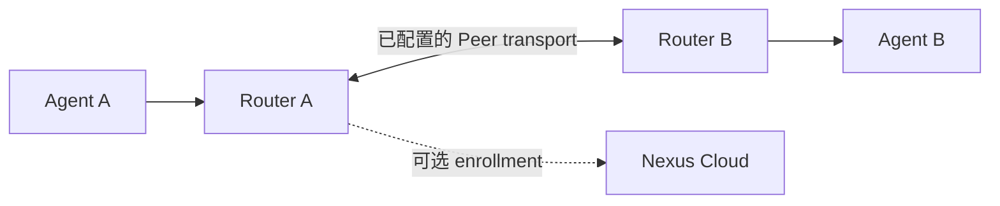

<div align="center">

# Nexus OpenWrt

**Give your Agents a network.**

[](LICENSE)
[](docs/user/en/index.md)
[](#引用)
[](https://github.com/Nexilume-AI/nexus-openwrt/actions/workflows/ci.yml)

`OpenWrt` · `LuCI` · `Edge routing`

[English](README.md) · **简体中文**

[功能](#可以做什么) · [快速开始](#快速开始) · [项目生态](#项目生态) · [参与贡献](#参与贡献) · [引用](#引用)

</div>

在 OpenWrt 上完成 Agent 注册、发现与能力路由，提供 LuCI 工作台、Cloud 连接及可选自托管 Relay / Directory。


*这是流程示意图，不是产品截图。实际连接需要完成下文的安装、配置与授权。*

## 可以做什么

- **Agent services**：LAN 注册与 Agent capability 调用。
- **Router network**：配置后的邻居发现和跨路由能力路由。
- **LuCI 双模式**：User mode 日常操作，Developer mode 诊断。
- **Cloud 连接**：enrollment，以及配置后的 Direct IPv6 / Cloud Relay。
- **可选 seed 角色**：独立自托管 Relay / Directory，不等同于 Cloud Relay。

## 快速开始

当前安装文档基线为 **OpenWrt 25.12.4 x86/64**。其他架构需要匹配 SDK 和真实设备验收。

1. 阅读[安装路径选择](docs/user/zh/getting-started/choose-path.md)。
2. 按[安装教程](docs/user/zh/getting-started/install.md)编译、签名并安装。
3. 打开 **Status → Agent Routing → User mode**。
4. 启用 **Agent services**，完成一个真实 SDK Agent 的注册和调用。
5. 按部署需要启用 Router network 或配对 Cloud。

> [!IMPORTANT]
> 当前是独立源码发布候选。桌面 VM 启动与构建脚本不等于预装镜像已完成真实开机验收；基础构建 helper 不生成可选 Node/Relay/Directory 角色包。不要关闭签名验证，也不要分发内部磁盘、真实配置或私钥。

## 看懂两种连接



跨路由 invoke 需要可用的 Peer transport 和调用权限。只修改 Agent 的 Router URL 不会自动打通 NAT。自建 Open Mesh seed 与 Cloud Relay 是两个独立部署。

## 文档

| 目标 | 入口 |
| --- | --- |
| 用户手册 | [中文](docs/user/zh/index.md) / [English](docs/user/en/index.md) |
| 跨路由调用 | [双路由器教程](docs/user/zh/tutorials/two-router.md) |
| Cloud transport | [Cloud Relay](docs/user/zh/guides/cloud-relay.md) |
| 自托管 seed | [Router roles](docs/user/zh/guides/router-roles.md) |
| Hyper-V 与 IPv6 | [桌面部署](deploy/desktop/README.md) |
| 编译、签名、主机测试与发布范围 | [完整参考](README_GUIDE.md) |
| 版本变化 | [Changelog](CHANGELOG.md) |

Nexus 自有代码采用 Nexus Community License 1.0；OpenWrt 固件和 Node 构建配方等保留各自许可，不能把整张固件称为仅 Apache-2.0。

## 项目生态

| 项目 | 职责 |
| --- | --- |
| [Cloud Community](https://github.com/Nexilume-AI/nexus-cloud-community) | Server、Web Console 与配套 Cloud Relay |
| [Python SDK](https://github.com/Nexilume-AI/nexus-agent-sdk-python) | Agent 应用与主动出站的 Computer Runtime |
| [OpenWrt](https://github.com/Nexilume-AI/nexus-openwrt) | 边缘注册、发现与能力路由 |
| [Mobile](https://github.com/Nexilume-AI/nexus-mobile) | 已授权的 Android 设备接入 |
| [Documentation](https://github.com/Nexilume-AI/nexus-docs) | 中英文教程与参考 |

设备组件独立安装与发布；是否可安装取决于仓库访问、发行包及版本兼容性。Cloud 启动不会自动安装它们。

## 参与贡献

请先阅读 [CONTRIBUTING.md](CONTRIBUTING.md)。欢迎修复问题、改进教程和补充翻译。

问题反馈请附组件版本与脱敏复现步骤，不要上传凭据、个人文件或真实设备配置。安全问题遵循 [SECURITY.md](SECURITY.md)。 CI 通过不等于所有平台均已完成生产验收。

## 引用

在研究或工程工作中使用 Nexus 时，可以引用对应仓库，并注明实际使用的 release 或 commit。[CITATION.cff](CITATION.cff) 提供机器可读元数据；这是软件引用，不代表已有论文或 DOI。

```bibtex
@misc{nexus_openwrt,
  author       = {{Nexus contributors}},
  title        = {Nexus OpenWrt},
  howpublished = {\url{https://github.com/Nexilume-AI/nexus-openwrt}},
  note         = {Software; specify the release or commit used}
}
```

## 许可证

Nexus 自有代码采用 [Nexus Community License 1.0](LICENSE)。第三方组件保留各自许可证与声明；公开文档不授予独立企业版实现的使用权。完整固件还包含其他许可证组件，见 [NOTICE](NOTICE) 和 [THIRD_PARTY.md](THIRD_PARTY.md)。

### Licensing conditions / 许可条件

Source-available, not unmodified Apache-2.0 or OSI-approved open source. Multi-tenant service operation and removal of existing Nexus UI branding require prior written authorization. Earlier Apache-2.0 grants and third-party licenses remain unchanged. Contributions require explicit agreement permitting commercial use and future relicensing. 许可说明：[LICENSING.md](LICENSING.md)。授权联系：**cary.nexilume@outlook.com**。
