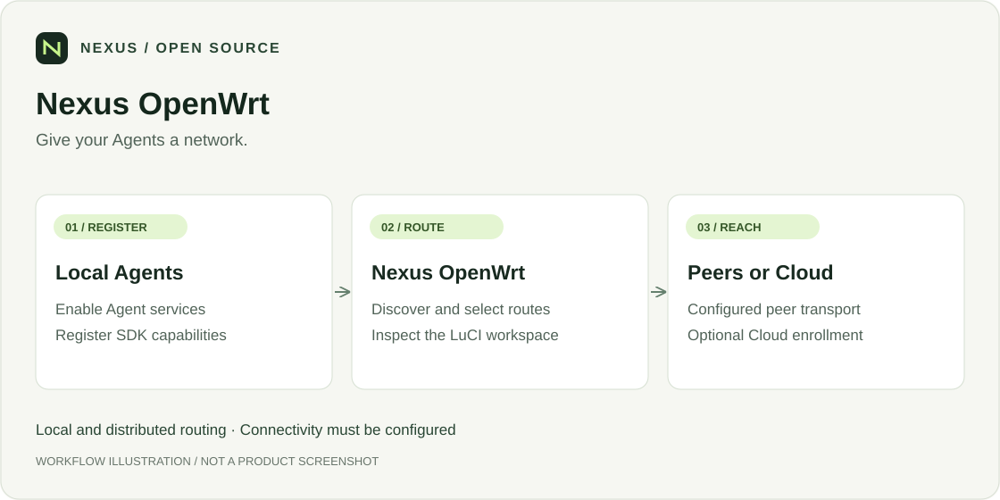
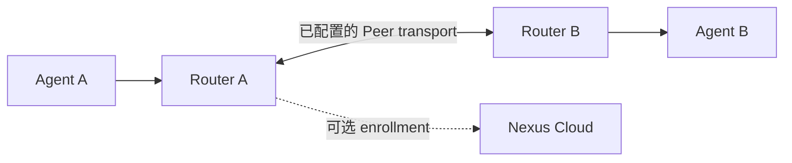

<div align="center">

# Nexus OpenWrt

**Give your Agents a network.**

[](LICENSE)
[](https://cloud.nexilume.com/)
[](docs/user/en/index.md)
[](#引用)
[](https://github.com/Nexilume-AI/nexus-openwrt/actions/workflows/ci.yml)

`OpenWrt` · `LuCI` · `Edge routing`

[English](README.md) · **简体中文**

[动机](#动机) · [功能](#可以做什么) · [快速开始](#快速开始) · [项目生态](#项目生态) · [参与贡献](#参与贡献) · [引用](#引用)

</div>

> **[在线体验 Nexus Cloud](https://cloud.nexilume.com/)**：在浏览器中探索 Nexus Cloud，也可以自行部署，开始使用。

在 OpenWrt 上完成 Agent 注册、发现与能力路由，提供 LuCI 工作台、Cloud 连接及可选自托管 Relay / Directory。

## 动机

Agent 可以运行在个人电脑、家庭服务器、边缘设备或云端，但它们通常分散在不同网络中。即使网络已经连通，调用者仍需要知道每个 Agent 的地址、提供的能力，以及地址变化或连接中断后如何继续访问。

**Nexus OpenWrt 希望让分散在不同设备和网络中的 Agent，能够按能力被发现和调用，而不必逐个维护地址与连接。**



*这是简化的能力路由示例，不是产品截图。调用者仍需配置接入路由器地址，并指定明确的能力 ID。网络连通与调用授权仍是前提；Cloud 配对是可选项。*

它将路由器变成 Agent 网络的连接节点：本地 Agent 向附近路由器注册能力，路由器在已配置的 Mesh 中交换能力路由，并通过可用的直连或 Relay 路径转发调用。应用面向能力发起请求，底层连接交由路由系统处理。

Nexus OpenWrt 可以独立组网，也可以接入 [Nexus Cloud](https://github.com/Nexilume-AI/nexus-cloud)，让边缘 Agent 进入统一的管理、发现和用户交互流程。Cloud 提供统一入口，OpenWrt 扩展边缘可达性，两者共同连接云端与本地能力。Cloud 配对是可选项，不是本地及跨路由器协作的前提。

### 为什么不直接连接？

1. **只有两三个固定 Agent？** 直接连接通常更简单。
2. **所有 Agent 都在一个中心环境？** 集中式 Gateway 通常更容易管理。
3. **Agent 分散在家庭、办公室和边缘设备，并频繁上下线？** Nexus OpenWrt 可以按能力发现和调用 Agent，而不必逐个维护地址与连接。

## 可以做什么

- **Agent services**：LAN 注册与 Agent capability 调用。
- **Router network**：配置后的邻居发现和跨路由能力路由。
- **LuCI 双模式**：User mode 日常操作，Developer mode 诊断。
- **Cloud 连接**：enrollment，以及配置后的 Direct IPv6 / Cloud Relay。
- **可选 seed 角色**：独立自托管 Relay / Directory，不等同于 Cloud Relay。

## 快速开始

当前安装文档基线为 **OpenWrt 25.12.4 x86/64**。其他架构需要匹配 SDK 和真实设备验收。

1. 从 [Releases](https://github.com/Nexilume-AI/nexus-openwrt/releases) 下载已签名的 **x86_64 Beta 安装包**。
2. 按[校验与安装指南](docs/package-install.md)安装，也可以[从源码构建](docs/user/zh/getting-started/install.md)。
3. 打开 **Status → Agent Routing → User mode**。
4. 启用 **Agent services**，完成一个真实 SDK Agent 的注册和调用。
5. 按部署需要启用 Router network 或配对 Cloud。

> [!IMPORTANT]
> 安装包仅适用于 **OpenWrt 25.12.4 x86/64**，不是整机固件或离线安装器。请保留匹配的官方软件源以获取依赖。本次不覆盖 ARM/MIPS 或预装桌面 VM 镜像。不要关闭签名验证，也不要分发真实配置或私钥。

| 安装档位 | 用途 |
| --- | --- |
| `nexus-agent-router` | Agent 路由、LuCI 和 Cloud Relay 客户端，不依赖 Node.js |
| `nexus-agent-router-relay` | 基础档位 + 自建 Open Mesh Relay |
| `nexus-agent-router-seed` | 基础档位 + 自建 Relay 和 Directory |

同一个签名压缩包包含三个档位。Relay/Seed 包含 Node.js；安装不会自动对外开放服务或完成 Cloud 配对。

## 看懂两种连接



跨路由 invoke 需要可用的 Peer transport 和调用权限。只修改 Agent 的 Router URL 不会自动打通 NAT。自建 Open Mesh seed 与 Cloud Relay 是两个独立部署。

## 文档

| 目标 | 入口 |
| --- | --- |
| 用户手册 | [中文](docs/user/zh/index.md) / [English](docs/user/en/index.md) |
| 跨路由调用 | [双路由器教程](docs/user/zh/tutorials/two-router.md) |
| Cloud transport | [Cloud Relay](docs/user/zh/guides/cloud-relay.md) |
| 自托管 seed | [Router roles](docs/user/zh/guides/router-roles.md) |
| Hyper-V 与 IPv6 | [桌面部署](deploy/desktop/README.md) |
| 编译、签名、主机测试与发布范围 | [完整参考](README_GUIDE_zh.md) / [English](README_GUIDE.md) |
| 版本变化 | [Changelog](CHANGELOG.md) |

Nexus 自有代码采用 Apache License 2.0 (modified)；OpenWrt 固件和 Node 构建配方等保留各自许可，不能把整张固件称为仅 Apache-2.0。

## 项目生态

| 项目 | 职责 |
| --- | --- |
| [Nexus Cloud](https://github.com/Nexilume-AI/nexus-cloud) | Server、Web Console 与配套 Cloud Relay |
| [Python SDK](https://github.com/Nexilume-AI/nexus-agent-sdk-python) | Agent 应用与主动出站的 Computer Runtime |
| [OpenWrt](https://github.com/Nexilume-AI/nexus-openwrt) | 边缘注册、发现与能力路由 |
| [Mobile](https://github.com/Nexilume-AI/nexus-mobile) | 已授权的 Android 设备接入 |
| [Documentation](https://github.com/Nexilume-AI/nexus-docs) | 中英文教程与参考 |

设备组件独立安装与发布；是否可安装取决于仓库访问、发行包及版本兼容性。Cloud 启动不会自动安装它们。

## 参与贡献

请先阅读 [CONTRIBUTING.md](CONTRIBUTING.md)。欢迎修复问题、改进教程和补充翻译。

问题反馈请附组件版本与脱敏复现步骤，不要上传凭据、个人文件或真实设备配置。安全问题遵循 [SECURITY.md](SECURITY.md)。 CI 通过不等于所有平台均已完成生产验收。

## 引用

如果 Nexus 对你的研究或工程工作有帮助，请引用以下技术报告，而不是软件仓库。[CITATION.cff](CITATION.cff) 的 `preferred-citation` 提供同一报告的机器可读元数据。

Nexilume Research. *Nexus: An Execution Fabric for AI Agents Across Cloud, Edge, and Devices*. 技术报告 NX-SYS-2026-001，2026 年 9 月。

```bibtex
@techreport{nexilume2026nexus,
  author      = {{Nexilume Research}},
  title       = {{Nexus}: An Execution Fabric for {AI} Agents Across Cloud, Edge, and Devices},
  institution = {Nexilume Research},
  type        = {Technical Report},
  number      = {NX-SYS-2026-001},
  year        = {2026},
  month       = sep
}
```

## 许可证

Nexus 自有代码采用 [Apache License 2.0 (modified)](LICENSE)。第三方组件保留各自许可证与声明；公开文档不授予独立企业版实现的使用权。完整固件还包含其他许可证组件，见 [NOTICE](NOTICE) 和 [THIRD_PARTY.md](THIRD_PARTY.md)。

### 许可条件

Nexus 采用 Apache License 2.0 的修改版，并附加以下条件。多租户服务运营及移除现有 Nexus 界面品牌标识须事先取得书面授权。此前的 Apache-2.0 授权和第三方许可证保持不变。贡献者须明确同意允许商业使用及未来重新许可的贡献协议。许可说明：[LICENSING.md](LICENSING.md)。授权联系：**cary.nexilume@outlook.com**。
