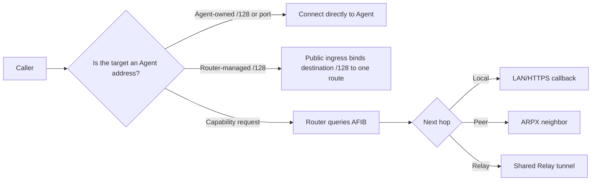

# Communication mode selector

“One IPv6 address per Agent,” “LAN mode,” “SVCB mode,” and “NAT mode” are not six mutually exclusive choices. A complete design combines three independent dimensions:

1. **Address ownership** — the Agent host owns the public address, or OpenWrt leases it.
2. **Data path** — direct to the Agent, through Router Access Proxy, or through a NAT Relay.
3. **Discovery** — static configuration, LAN DNS-SD, DNS SVCB, or Directory assignment.

For example, “router-managed `/128` + direct IPv6 + static address” and the same path with external DNS differ only in discovery.

## Choose by constraint

| Constraint | Preferred design | Why |
| --- | --- | --- |
| Agent and Router share a trusted LAN | LAN callback + Router Access Proxy | The Router maintains callback mappings from the Agent lease |
| One host address, several Agents | One IPv6, a different port per Agent | No extra address management |
| Host has a usable `/64` | Host Alias: one `/128` per Agent | The address identifies the Agent; ports may be reused |
| A prefix is routed to OpenWrt | Router-managed `/128` | Address, capability lease, ingress policy, and route are bound together |
| IPv6 is reachable and the caller knows the `/128` | Direct IPv6 | No Directory, Relay, or capability lookup |
| A remote Router must be found across domains | DNSSEC SVCB discovery | Produces a validated Router candidate, which still needs admission |
| Neither side accepts inbound traffic | Directory + Relay | Both Routers establish outbound connections |

## Common combinations

| Combination | Target selector | Discovery | Data path | Typical use |
| --- | --- | --- | --- | --- |
| LAN callback | Private IPv4/ULA and callback port | SDK registration | Caller → Router → Agent | Home, lab, enterprise LAN |
| One address, many ports | Shared public IPv6, distinct ports | Static, DNS, or Directory | Caller → Agent | A few Agents on one public host |
| Host Alias | One host-owned `/128` per Agent | Static or external directory | Caller → Agent | Agent server with a `/64` |
| Router-managed IPv6 | One `/128` per local capability-route lease | Registration response or external directory | Caller → `/128`:7443 → Router → Agent | Governed public ingress |
| LAN/SVCB Router neighbor | Router ARPX endpoint | DNS-SD or DNSSEC SVCB | Router ↔ Router → Agent | Multi-Router route propagation |
| NAT Relay | No inbound public address required | Directory assigns a Relay | Router → Relay ← Router | Branches, mobile networks, CGNAT |

:::important Implementation boundary
LAN DNS-SD and DNS SVCB discover **Router candidates**, not individual Agents, and do not create capability routes. Admission must create an ARPX Peer before remote capabilities can enter ARIB/AFIB.
:::

Continue with [address ownership](addressing.md), [discovery and trust](discovery.md), and [scenario recipes](scenarios.md). See the [LuCI page guide](../reference/luci-pages/index.md) for UI fields.

Self-hosted OpenWrt Open Mesh and Cloud Relay have separate connection state and trust configuration. See [Cloud Relay](../guides/cloud-relay.md) for Cloud (including Community), or [node roles](../guides/router-roles.md) for self-hosted seeds.
