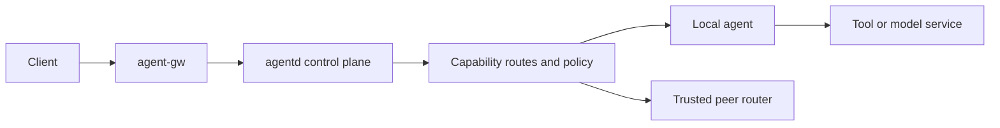

# Architecture

The control plane maintains agent leases, capabilities, and peer relationships. The gateway accepts calls and streaming responses. Adapters map different agent protocols to one routing model. LuCI manages configuration and displays runtime state.

A typical call passes through capability registration, route generation, discovery or route selection, authentication and policy checks, forwarding, and response delivery. A route is removed when its lease expires, trust is revoked, or health checks fail.
