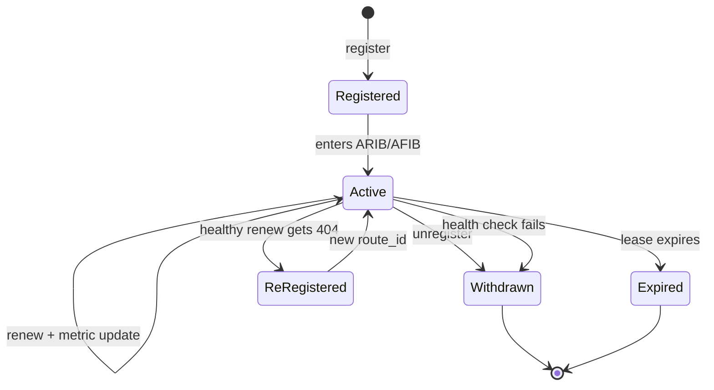

# Capability, route, and lease lifecycle

A capability is an Agent's callable contract. A route is a temporary fact about how to reach one capability instance. Keeping them separate allows one capability to have several instances, paths, and health states.

## From declaration to route

A registration answers at least these questions:

- `intent`: what it does, such as `demo.echo`;
- `version`: the contract major version;
- `origin`: which Agent instance provides it;
- `endpoint`: where the Router connects;
- `tenant` and `region`: isolation and placement boundaries;
- cost, latency, trust, and load metrics for constraints and ordering;
- `lease_seconds`: how soon the declaration must be proven live again.

A successful registration returns a random `route_id` and generation. The route ID identifies this lease, not a permanent Agent identity. Re-registration can produce a new ID.

## Why leases exist

Processes crash, hosts lose power, and networks partition. Explicit unregister alone would leave dead instances in the catalog. A lease turns liveness into a fact that must be renewed. Healthy Agents renew; unreachable Agents are eventually removed.

The SDK normally renews near 60% of the lease duration with jitter so many Agents do not renew at once. The allowed fraction is 20% to 80%. The Router uses a monotonic clock for local leases, so wall-clock correction does not extend or shorten them unexpectedly.

## Health is not the same as presence

Being able to renew proves that the process can reach the Router, not that its business handler works. The high-level SDK ties listener health into renewal: a failed health check stops renewal and withdraws the route. Policy health thresholds can require consecutive failures or successes to prevent route flapping.

The self-healing boundary is deliberate. A healthy route whose renewal returns 404 may re-register and change route ID. An unhealthy local service is not re-registered to hide the fault.

## ARIB and AFIB

The ARIB contains candidate facts learned locally, statically, or from peers. The AFIB is the forwardable view after policy, identity, health, constraints, and underlay reachability. A route may remain in the ARIB while being absent from the AFIB.

Dynamic state stays in memory or `/tmp` to avoid high-frequency flash writes. Static configuration, policy, and trust anchors are the persistent state.

## What operators should observe

- Agents answer “who registered?”
- Routes answer “what candidates and sources exist?”
- Lookup explanation answers “why was a candidate selected or excluded?”
- Generations show whether two observations describe the same view.
- Lease and health streaks show whether a route is converging toward withdrawal or recovery.

Use the [route lifecycle lab](../tutorials/route-lifecycle-lab.md) to observe this behavior, then read [From ARIB to AFIB](routing-selection.md).
