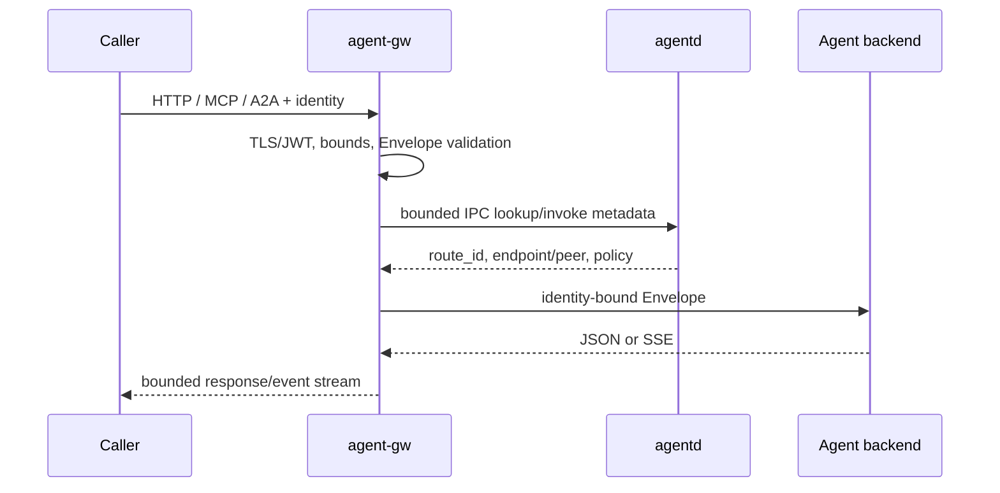

# How one invocation crosses the system

Registration and route selection are control-plane work. Requests and results are data-plane work. Following the boundaries makes it easier to locate authentication failures, route misses, backend timeouts, and stream interruption.

## 1. Protocols enter one model

Native HTTP, MCP tool calls, and A2A skills map into an explicit Envelope. Mapping comes from tool names, Agent Card skill IDs, or configured registries, not natural-language arguments. Business payload is separate from routing headers.

## 2. The edge creates trusted context

`agent-gw` verifies TLS, JWT, or a transaction token and writes tenant/source identity from verified claims. Conflicting self-reported values are replaced. It also checks request size, concurrency, deadline, hop limit, and retry declarations before opening a backend connection.

## 3. The control plane returns an executable route

Bounded local IPC asks `agentd` for a route. The answer includes route ID, policy, quota, endpoint or Relay metadata. High-volume payload chunks do not make repeated ubus calls.

## 4. Local, transit, and Relay paths

- A local route connects to the registered backend.
- A direct peer path uses the IP underlay to reach another Router.
- A Relay path uses an outbound tunnel and validated target Router metadata; it is not an arbitrary TCP proxy.

Path vectors prevent control-plane loops, while hop limit is the data-plane backstop.

## 5. Responses and streams

Synchronous responses have explicit size and timeout bounds. After SSE START, a component can continue events or close the connection, but cannot safely replace the stream with an unrelated JSON error. Client disconnect becomes cancellation rather than permission to buffer without limit.

| Symptom | Likely boundary |
| --- | --- |
| 401/403 | authentication/authorization edge |
| 404/no candidate | AFIB, lease, or Policy RIB |
| 408 | expired Envelope deadline |
| 502 endpoint rejected | backend address or TLS identity policy |
| 504 | selected backend timeout |
| resume conflict | task ID, request fingerprint, or history cursor |

See SDK [Envelope and authentication](https://nexilume-ai.github.io/nexus-docs/en/sdk/concepts/envelope-auth) and OpenWrt [common problems](../troubleshooting/common.md).
