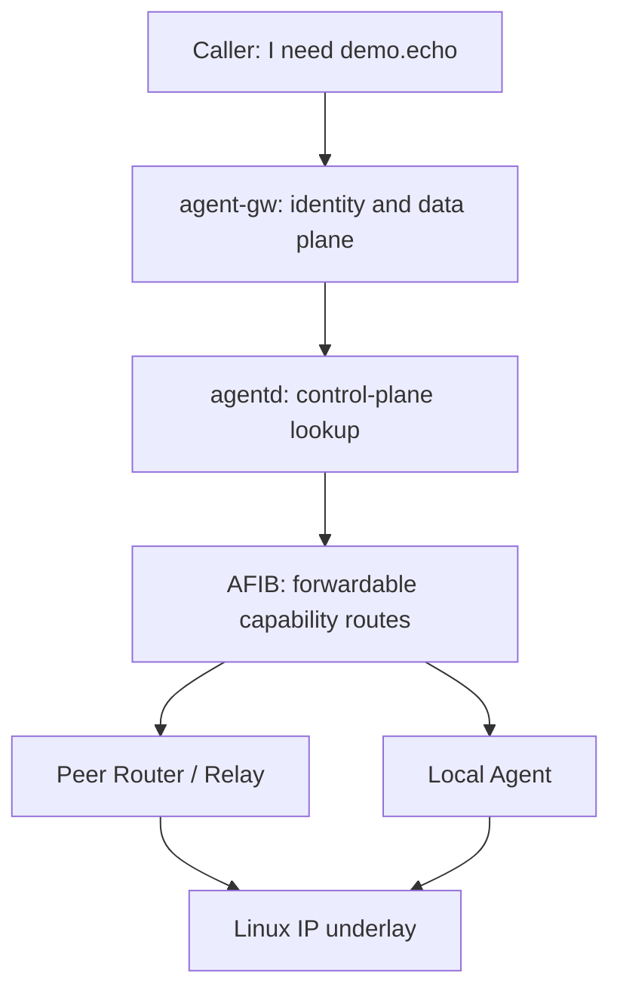

# The two-plane mental model

A conventional router answers “where is the next hop for this IP packet?” Nexus Agent Router also answers “which Agent provides this capability, is it healthy, and may this caller use it?” Those questions have different data, rates of change, and security boundaries, so the system uses two cooperating but failure-isolated planes.

## Two different maps

The **IP underlay** consists of the Linux IPv4/IPv6 FIB, netifd, fw4, and DNS. It handles addresses, interfaces, and ordinary network reachability.

The **Agent overlay** consists of the capability catalog, candidate routes, policy, leases, and Agent identities. It handles explicit capabilities such as `demo.echo`, not IP prefixes.

The Agent plane first selects an endpoint or next Router. The IP plane then carries the bytes. An Agent-plane failure must not break DHCP, DNS, or normal IP forwarding. Conversely, an unreachable underlay next hop cannot remain an eligible capability route.

## Why the components are separate

| Component | Primary responsibility | Must not become |
| --- | --- | --- |
| `agentd` | registration, leases, ARIB/AFIB, policy, peers, recovery | a large-response or model-stream proxy |
| `agent-gw` | TLS/JWT, Envelope validation, invoke/SSE forwarding, limits | the owner of the full routing protocol |
| `agent-adapter` | deterministic MCP/A2A mapping | a Prompt classifier that guesses intent |
| LuCI | configuration and state display | the home of core routing logic |

This split separates slowly changing control state from high-frequency payload flow. SSE chunks do not need a ubus round trip, and capability changes do not modify the kernel IP FIB.

## Four stages of a capability call

1. **Publish:** an Agent registers an intent, origin, endpoint, lease, and metrics.
2. **Compile:** `agentd` stores candidates in the ARIB and creates the AFIB after identity, policy, health, and constraint checks.
3. **Invoke:** `agent-gw` verifies identity and the Envelope, selects an AFIB route, and forwards the request.
4. **Converge:** renewal, health, peer, or policy changes update or withdraw the AFIB route.

That is why discovering a device on the LAN is not authorization, and why a crashed Agent does not remain routable forever.

## Three invariants for the rest of this book

- **Routing uses explicit metadata.** The Router does not inspect Prompts, tool arguments, model output, or tokens to infer intent.
- **Identity comes from authentication.** Verified claims override self-declared tenant and source Agent fields.
- **Resources are bounded.** Routes, frames, responses, stream history, and leases have explicit limits.

## Trade-offs

Two planes add IPC, state synchronization, and compatibility work. In return, failures remain isolated, route choices are explainable, and protocol adapters remain deterministic. Explicit intent is less magical than natural-language routing, but it is testable and authorizable.

Continue with [Capability, route, and lease lifecycle](capability-lifecycle.md), or start the [route lifecycle lab](../tutorials/route-lifecycle-lab.md).
