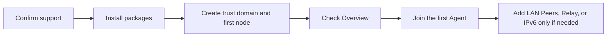

# What do you want to accomplish?

You do not need to read the documentation front to back. Choose the closest goal and follow one verifiable path.

| Goal | Start here | Done when |
| --- | --- | --- |
| Try the full system on a computer | [Desktop VM](desktop-vm.md) (image publication and boot acceptance pending) | LuCI login, Agent registration and authenticated invocation succeed |
| Configure an Agent private cloud network | [Install and build](install.md) → [Configure the private cloud](quick-setup.md) | The first node is Healthy and an Agent can register and be invoked |
| Publish a Python Agent | [Build your first Agent](https://nexilume-ai.github.io/nexus-docs/en/sdk/quickstart/first-agent) | `demo.echo` appears under Capability Routes |
| Invoke a capability from Python | [Call your first Agent](https://nexilume-ai.github.io/nexus-docs/en/sdk/quickstart/call-first-agent) | The terminal receives a JSON response |
| Extend to several LAN nodes | [Connect two Routers](../tutorials/two-router.md) | One ARPX session is up and a remote capability is visible |
| Extend the private cloud across NAT | [Configure private-cloud node roles](../guides/router-roles.md) | Relay or Directory status is Ready |
| Reach an Agent over public IPv6 | [Configure IPv6](../guides/ipv6.md) | Cross-subnet TCP and authenticated calls both work |
| Upgrade or remove packages | [Upgrade and uninstall](upgrade-uninstall.md) | Services and configuration match the intended state |
| Diagnose a field problem | [Collect diagnostics](../troubleshooting/diagnostics.md) | You have a redacted diagnostic report |

## Recommended private-cloud setup order

A single node is already a working minimum Agent private cloud; Relay and Directory are not prerequisites. Read the [support matrix](support-matrix.md) first. Complete target validation currently covers OpenWrt 25.12.4 x86/64 only; build and test before deploying another architecture.
