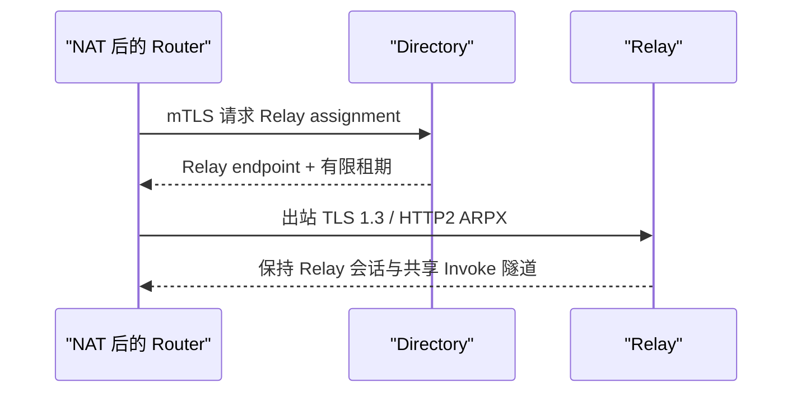

# 发现、信任与通信路径

发现回答“可能连接谁”，信任准入回答“是否允许成为 Peer”，路由传播回答“对方能提供什么能力”。三者必须分开观察。

## LAN DNS-SD

Router 通过 `_agent-router._tcp.local` 发布和消费 DNS-SD 记录。候选包含 Router ID、域、地址、端口和租约时间等有限元数据，不包含 prompt、token 或 Agent 调用内容。

当前默认 Open Mesh 会自动准入经过校验的 LAN Router。需要手工、同域或 allowlist 管理时，先在 **Developer mode → Advanced Settings → Router Mesh** 切换 **Managed peer trust**，再配置 LAN admission。域名相同不代表默认存在隔离边界。

## DNSSEC SVCB

跨域发现查询 `_agents.<domain>` 的 SVCB 记录。Router 只接受本地验证解析器返回且带有 DNSSEC authenticated-data 证据的结果。SVCB 中的目标、端口和 `ipv4hint` 仍然只是候选信息；`ipv4hint` 不是信任证明。

SVCB 适合跨管理域找到 Router，不是 Agent 数据传输协议。Open Mesh 可自动准入经过 DNSSEC 校验的候选；Managed peer trust 则按 Peer Trust、Agent Card / Directory 策略处理。两种模式都仍需收到能力通告才能形成可选路由。

## Directory 与 NAT Relay

位于 NAT 后的 Node 主动通过 mTLS 向 Directory 请求短租期 Relay 分配，再主动连接 Relay，建立 TLS 1.3 + HTTP/2 ARPX 长连接。Directory 只分配 Relay，不直接授予远端 Agent 能力路由的信任。



## 从候选到可调用路由

```text
DNS-SD / SVCB 候选
        ↓ 手工或策略准入
动态 ARPX Peer
        ↓ 对端发布带租约的能力
ARIB 候选
        ↓ 身份策略、硬约束、评分
AFIB 路由
        ↓
Invoke
```

删除或撤销 Peer 后，已学习能力会立即撤销或进入受控的 graceful expiry；自动准入来源若仍有效，候选可能在下次刷新时再次出现，因此还要修改自动准入模式或 allowlist。

OpenWrt 自托管 Open Mesh 与 Cloud Relay 使用独立连接状态和信任配置。Cloud（含社区版）的接入见[Cloud Relay](../guides/cloud-relay.md)，自托管 seed 见[节点角色](../guides/router-roles.md)。
