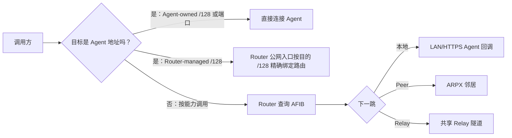

# 通信模式选择器

“每个 Agent 一个 IPv6 地址”“LAN 模式”“SVCB 模式”和“NAT 模式”不是同一层次的六个互斥选项。一个完整方案由三个维度组合而成：

1. **地址归属**：公网地址由 Agent 主机拥有，还是由 OpenWrt 路由器按租约托管。
2. **通信路径**：调用直接到 Agent、经过 Router Access Proxy，还是经过 NAT Relay。
3. **发现机制**：地址手工配置、LAN DNS-SD、DNS SVCB，或 Directory 分配。

例如，“路由器托管 `/128` + 直接 IPv6 + 手工地址”与“路由器托管 `/128` + 直接 IPv6 + 外部 DNS”使用同一数据路径，只是发现方式不同。

## 先做选择

| 条件 | 首选方案 | 原因 |
| --- | --- | --- |
| Agent 与 Router 在同一可信 LAN | LAN Agent 回调 + Router Access Proxy | 配置最少，Agent 注册后路由器自动维护回调映射 |
| 一台主机只有一个稳定公网 IPv6，运行多个 Agent | 单 IPv6、多 Agent 分端口 | 不需要额外地址管理，每个 Agent 使用不同端口 |
| 主机拥有可用 `/64`，希望每个 Agent 都有独立地址 | Host Alias：每 Agent 一个 `/128` | 地址直接标识 Agent，多个 Agent 可复用同一端口 |
| 公网前缀路由到 OpenWrt，希望由路由器统一治理 | Router-managed `/128` | 地址、能力路由租约、入口策略由路由器精确绑定 |
| 两端已有 IPv6 可达性且调用方知道目标 `/128` | Direct IPv6 | 不经过查表、Directory 或 Relay，路径最短 |
| 跨域，需要用 DNS 找到远端 Router | DNSSEC + SVCB 候选发现 | DNS 只提供经验证的 Router 候选，之后仍需信任准入 |
| 双方位于 NAT 后，不能接受入站连接 | Directory + Relay | 双方主动建立出站连接，由 Relay 承载跨 NAT 调用 |

## 六种常见组合

| 组合 | 地址选择 Agent 的方式 | 发现 | 数据路径 | 适用场景 |
| --- | --- | --- | --- | --- |
| LAN 自动回调 | Agent 私网 IPv4/ULA + 回调端口 | SDK 注册 | Caller → Router → Agent | 家庭、实验室、企业内网 |
| 单地址分端口 | 同一公网 IPv6，不同端口 | 手工、DNS 或 Directory | Caller → Agent | 一台公网主机运行少量 Agent |
| Host Alias | 每 Agent 一个主机拥有的 `/128`，端口可相同 | 手工或外部目录 | Caller → Agent | 有 `/64` 的 Agent 服务器集群 |
| Router-managed IPv6 | 每条本地能力路由租约绑定一个 `/128` | 注册响应、手工或外部目录 | Caller → `/128`:7443 → Router → Agent | 统一入口、审计和策略治理 |
| LAN / SVCB Router 邻居 | Router 地址与 ARPX 端点 | DNS-SD 或 DNSSEC SVCB | Router ↔ Router → Agent | 多路由器能力传播 |
| NAT Relay | Router 无需可入站的公网地址 | Directory 分配 Relay | Router → Relay ← Router | 分支网络、移动网络、CGNAT |

:::important 当前实现边界
LAN DNS-SD 和 DNS SVCB 发现的是 **Router 候选**，不会直接发现某个 Agent，也不会自动生成能力路由。候选必须经过手工或策略准入，建立 ARPX Peer 后，远端能力才可能进入 ARIB/AFIB。
:::

## 一次调用如何定位目标

继续阅读[地址归属模型](addressing.md)、[发现、信任与路径](discovery.md)和[按场景配置](scenarios.md)。界面字段请查阅 [LuCI 页面总览](../reference/luci-pages/index.md)。

OpenWrt 自托管 Open Mesh 与 Cloud Relay 使用独立连接状态和信任配置。Cloud（含社区版）的接入见[Cloud Relay](../guides/cloud-relay.md)，自托管 seed 见[节点角色](../guides/router-roles.md)。
