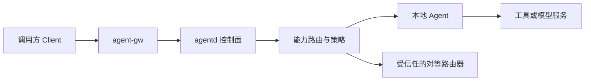

# 系统架构

```mermaid
flowchart LR
  C["调用方 Client"] --> G["agent-gw"]
  G --> D["agentd 控制面"]
  D --> R["能力路由与策略"]
  R --> A["本地 Agent"]
  R --> P["受信任的对等路由器"]
  A --> S["工具或模型服务"]
```

控制面维护 Agent 租约、能力和对等关系；网关承接调用与流式响应；适配层把不同 Agent 协议映射到统一的路由模型。LuCI 是这些配置与状态的管理界面。

一次典型调用经历：能力注册 → 路由生成 → 调用方发现或指定能力 → 认证与策略检查 → 转发 → 返回结果。租约过期、信任撤销或健康检查失败时，对应路由应被移除。
