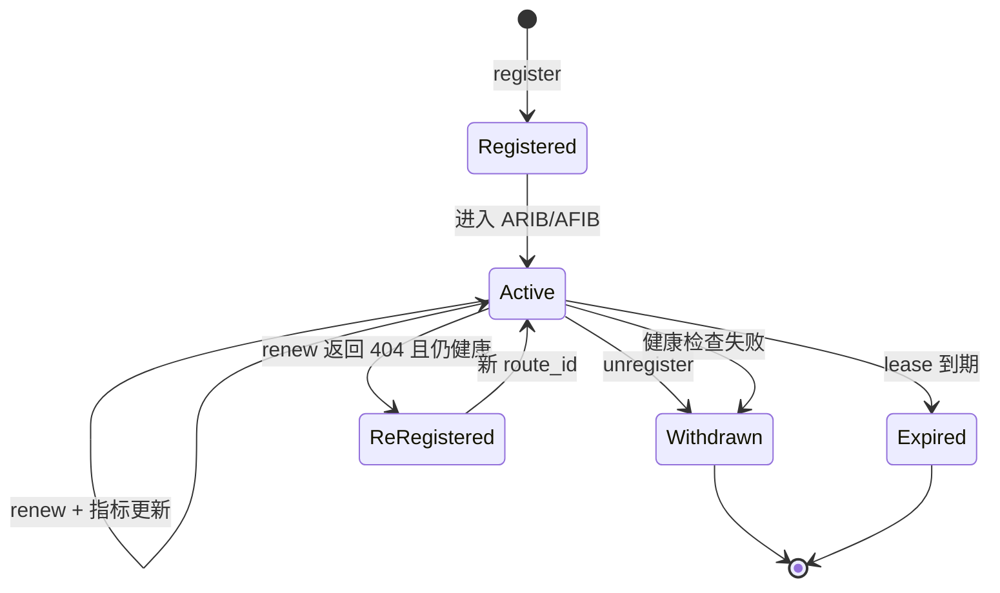

# 能力、路由与租约生命周期

能力是 Agent 对外声明的可调用契约，路由是“如何到达某个能力实例”的临时事实。把二者分开，才能让同一能力拥有多个实例、多个网络路径和独立的健康状态。

## 从能力声明到路由

一项注册至少回答这些问题：

- `intent`：要完成什么，例如 `demo.echo`；
- `version`：契约的 major version；
- `origin`：哪个 Agent 实例提供它，例如 `agent://demo/echo-server`；
- `endpoint`：路由器最终连接到哪里；
- `tenant`、`region`：隔离与位置边界；
- `cost_microunits`、`latency_ms`、`trust`、`load_permille`：硬约束和排序所需指标；
- `lease_seconds`：这条声明在多久内必须被再次证明有效。

注册成功后会得到随机 `route_id` 和当前 generation。`route_id` 标识的是一次路由租约，不是永久 Agent 身份；重新注册可能得到新的 ID。

## 为什么使用租约

进程可能崩溃、主机可能断电、网络可能分区。若只依靠显式注销，故障实例会永久留在目录中。租约把“仍然可用”变成需要周期证明的事实：Agent 正常运行时续租；无法续租时，路由器最终自动清除状态。

SDK 默认在租期的 60% 左右续租，并加入少量随机抖动，避免大量 Agent 同时请求。允许范围是 20% 到 80%。路由器使用单调时钟计算本地租约，系统时间校准不会意外延长或缩短它。

## 健康与存在不是一回事

能续租只说明 Agent 进程还能联系路由器，不保证业务处理器健康。高层 SDK 把监听器健康检查接入自动续租：健康检查失败时停止续租并主动撤销路由。路由策略还可设置连续失败/恢复阈值，防止一次瞬时抖动引发频繁上下线。

SDK 的自愈边界也很明确：健康路由续租收到 404 时可以重新注册并切换 `route_id`；若本地健康检查已经失败，则不会用重新注册掩盖故障。

## ARIB 与 AFIB

ARIB 保存本地、静态、邻居学习等来源的候选事实。AFIB 是经过策略、身份、健康、约束和底层可达性过滤后的可转发视图。某条记录可以仍在 ARIB，却因策略拒绝或健康失败不出现在 AFIB。

动态状态保存在内存或 `/tmp`，避免高频续租写坏 flash。静态配置、策略和信任锚才进入 `/etc/config` 等持久位置。

## 运维上应该观察什么

- Agent 列表回答“谁注册了”；
- 路由列表回答“有哪些候选及来源”；
- lookup 解释回答“为什么某条候选被选中或排除”；
- generation 回答“读到的是否仍是同一版路由视图”；
- 租约剩余时间和健康 streak 回答“状态是否正在趋向撤销或恢复”。

动手观察这些变化，请完成[路由生命周期实验](../tutorials/route-lifecycle-lab.md)。选路细节见[从 ARIB 到 AFIB](routing-selection.md)。
