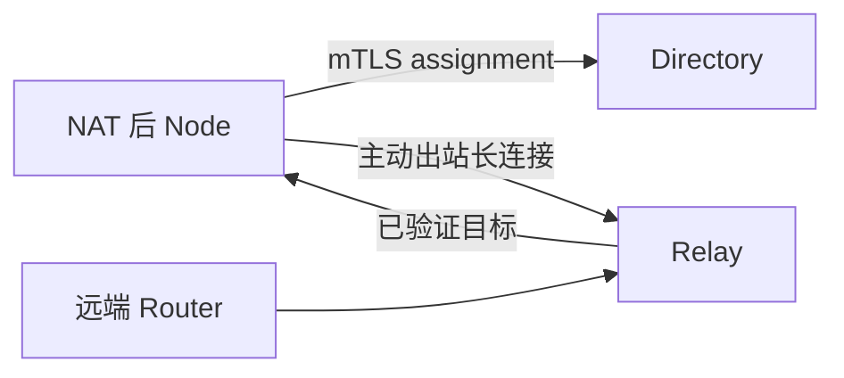

# 发现、信任、邻居与 Relay

“知道某台 Router 在哪里”“愿意与它建立会话”“允许它发布或调用哪些能力”是三个独立问题。当前 Open Mesh 默认自动准入经过发现校验的 Router；需要显式审批边界时使用 Managed peer trust。自动准入不会跳过能力租约与路由策略。

## LAN 发现只产生候选

Router 可通过 `_agent-router._tcp.local` DNS-SD 发布身份。接收端从 `umdns` 缓存构建有界候选表，并校验 TXT 字段、来源和 TTL。Open Mesh 默认可由有效候选自动创建 Peer；候选本身不会直接写成 Agent 能力路由。

在 Managed peer trust 中，LAN admission 决定手动、同域或 allowlist 准入。Open Mesh 是独立的开放组网模式，可以跨域交换能力；不能仅凭 domain 判断授权边界。

## ARPX 邻居交换什么

受信任 Router 之间通过 mTLS/HTTP2 ARPX 会话交换 OPEN、HEARTBEAT、能力 UPDATE/WITHDRAW 和快照消息。每条能力通告带 boot epoch、sequence、remaining lease、path vector、指标和策略标签。

- sequence 防止旧增量覆盖新状态；
- remaining lease 避免把远端单调时钟当成本地时间；
- path vector 与 split horizon 防止环路；
- snapshot 在重连后协调缺失路由；
- stale/graceful timeout 允许短断线恢复，又不会永久保留旧路由。

## Reflector 的取舍

全互联需要每台 Router 与所有其他 Router 建会话。Reflector 通过集中反射能力降低连接数，但增加了依赖点和路径长度。系统因此保留 direct 与 reflector 两种角色，并继续在反射时执行防环和跳数限制。

## Directory 与 Relay 解决 NAT

处于 NAT 后的 Node 往往不能接受 Internet 入站连接。Node 可以通过 mTLS 向 Directory 获取带租约的 Relay 分配，然后主动建立 outbound-only ARPX/HTTP2 隧道：

Directory 回答“应该连接哪个 Relay”；Relay 搬运受约束的控制与调用流量；Node 仍拥有自己的能力和策略状态。Relay 分配有租约，撤销或到期后不能继续当作永久授权。

## 信任仍然分层

传输层 mTLS 证明对端持有受信证书；Router/Directory trust 决定是否接受其控制信息；Policy RIB 决定具体 tenant、source 和 intent 是否可调用；Agent Card 信任决定卡片身份是否被接受。任何一层通过都不能替代其他层。

## 何时选择哪种拓扑

- 单 LAN、小规模：发现 + 手动或 allowlist 准入。
- 固定站点互联：静态 direct peer。
- 多站点中心辐射：Reflector，配合独立故障监控。
- NAT/跨互联网：Directory + Relay，保持 Node 主动出站。

实际配置入口见[路由器角色](../guides/router-roles.md)和[双路由器教程](../tutorials/two-router.md)。

OpenWrt 自托管 Open Mesh 与 Cloud Relay 使用独立连接状态和信任配置。Cloud（含社区版）的接入见[Cloud Relay](../guides/cloud-relay.md)，自托管 seed 见[节点角色](../guides/router-roles.md)。
