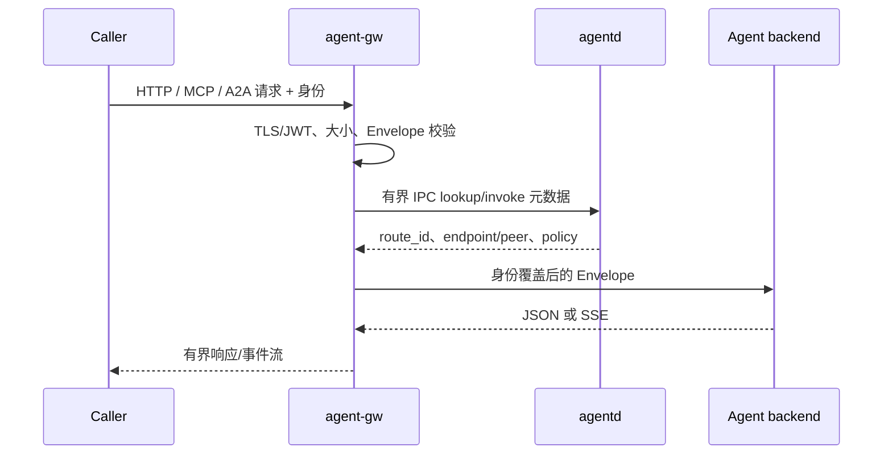

# 一次调用如何穿过系统

注册和选路属于控制面，真正的请求与结果属于数据面。理解一条调用经过哪些边界，有助于定位 401、无路由、后端超时和流中断分别发生在哪里。

## 1. 协议进入统一模型

原生 HTTP、MCP tool call 和 A2A skill 都会映射为显式 Envelope。映射来自工具名、Agent Card skill ID 或已配置注册表，不分析自然语言参数。业务 payload 与路由头分离，控制面只处理 intent、身份、约束、deadline、任务 ID 等元数据。

## 2. 入口先建立可信上下文

`agent-gw` 验证 TLS、JWT 或 transaction token，并用验证后的 claims 写入 tenant 和 source Agent。客户端自报的相冲突字段会被覆盖。网关还检查请求大小、并发、deadline、hop limit 和重试声明；失败时在连接后端前关闭请求。

## 3. 控制面返回可执行路由

网关通过有界本地 IPC 查询 `agentd`。返回的不只是 URL，还包括 route ID、策略结果、配额、Relay peer 与目标 Router 等经过验证的元数据。高频数据块不会反复调用 ubus。

## 4. 本地、Transit 与 Relay

- **本地 Agent**：网关连接注册 endpoint，转发身份覆盖后的 Envelope。
- **LAN/直接 peer**：底层 IP 把请求送到下一台 Router，再执行相同安全边界。
- **Relay**：Node 主动维持出站隧道，Relay 根据经过验证的目标 Router 转发；它不是开放的任意 TCP 代理。

每经过一跳，hop limit 递减。控制面的 path vector 防止路由环，数据面的 hop limit 是第二道保护。

## 5. 返回值与流

同步响应有明确大小和超时上限。SSE 在 START 后只能继续传事件或关闭连接，因为此时已不能安全地改写成一个新的 JSON 错误。客户端断开会成为取消信号，组件不得无限缓存下游数据。

## 错误定位速查

| 现象 | 更可能的边界 |
| --- | --- |
| 401/403 | 认证或授权入口 |
| 404/无候选 | AFIB、租约或 Policy RIB |
| 408 | Envelope deadline 已过 |
| 502 endpoint rejected | 后端地址或 TLS 身份策略 |
| 504 | 已选后端超时 |
| 流恢复冲突 | task ID、请求指纹或历史游标 |

更深入的身份边界见 SDK 的 [Envelope 与认证](https://nexilume-ai.github.io/nexus-docs/sdk/concepts/envelope-auth)。运维错误码见[常见问题](../troubleshooting/common.md)。
