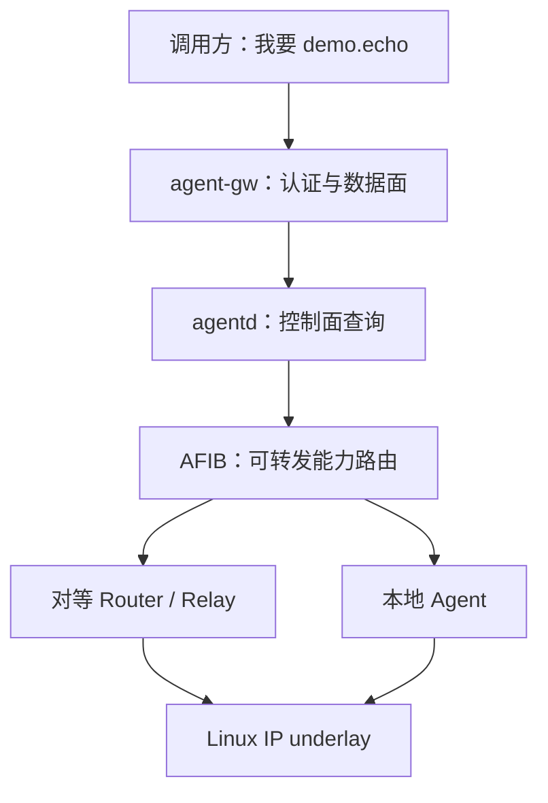

# 双平面心智模型

传统路由器回答“这个 IP 包下一跳发到哪里”，Nexus Agent Router 还要回答“哪个 Agent 能完成某项能力、当前是否可用、调用者是否有权使用”。两类问题的数据、变化速度和安全边界不同，因此系统把它们分成两个协作但故障隔离的平面。

## 两张不同的地图

**IP underlay（底层网络）**由 Linux IPv4/IPv6 FIB、netifd、fw4 和 DNS 组成。它处理地址、接口和普通网络可达性。

**Agent overlay（能力网络）**由能力目录、候选路由、策略、租约和 Agent 身份组成。它处理 `demo.echo` 这类显式能力，而不是 IP 前缀。

先由 Agent 平面选出 endpoint 或下一台 Router，再由 IP 平面把字节真正送达。Agent 平面故障不应破坏 DHCP、DNS 或普通 IP 转发；反过来，底层地址不可达时，对应能力路由也不能继续被选中。

## 组件为什么分开

| 组件 | 主要责任 | 不应该承担 |
| --- | --- | --- |
| `agentd` | 注册、租约、ARIB/AFIB、策略、邻居、恢复 | 搬运大响应、等待模型推理 |
| `agent-gw` | TLS/JWT、Envelope 校验、调用与 SSE 转发、限额 | 维护完整路由协议状态 |
| `agent-adapter` | MCP、A2A 与统一调用模型之间的确定性映射 | 根据 Prompt 猜测 intent |
| LuCI | 配置与状态展示 | 包含核心选路逻辑 |

这种划分把慢变化的控制状态与高频数据流隔开。流式响应不需要每个数据块都经过 ubus；路由变化也不需要修改 Linux 内核 FIB。

## 一次能力调用的四个阶段

1. **发布**：Agent 注册 intent、origin、endpoint、租约和指标。
2. **编译**：`agentd` 把全部候选放入 ARIB，再按身份、策略、健康和约束生成 AFIB。
3. **调用**：`agent-gw` 验证身份和 Envelope，从 AFIB 选择路由并转发。
4. **收敛**：续租、健康变化、邻居断开或策略重载使 AFIB 更新或撤销路由。

这解释了为什么“在 LAN 发现了设备”不等于“已经授权调用”，也解释了为什么 Agent 进程退出后路由不会永远残留。

## 三条贯穿全书的不变量

- **路由只看显式元数据**：系统不读取 Prompt、工具参数或模型输出推测意图。
- **身份来自认证上下文**：客户端 JSON 中自报的 tenant 与 source Agent 会被已验证身份覆盖。
- **资源始终有界**：路由、帧、响应、流历史和租约都有上限，低内存路由器不会为了“无限灵活”承担无限状态。

## 取舍

双平面比单进程代理多了 IPC、状态同步和版本兼容成本，但换来了故障隔离、可解释选路和协议适配能力。显式 intent 不如自然语言路由“神奇”，却能审计、测试并稳定授权。

下一章阅读[能力、路由与租约生命周期](capability-lifecycle.md)。想先动手，可完成[观察完整路由生命周期](../tutorials/route-lifecycle-lab.md)。
