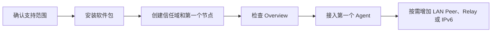

# 你现在想完成什么？

不必从头读完整套文档。选择最接近的目标，从一条可验证路径开始。

| 你的目标 | 从这里开始 | 完成标志 |
| --- | --- | --- |
| 在电脑上体验完整系统 | [电脑虚拟机](desktop-vm.md)（镜像发布与开机验收待完成） | LuCI 可登录，Agent 注册和认证调用成功 |
| 配置 Agent 私有云网络 | [安装与构建](install.md) → [配置 Agent 私有云网络](quick-setup.md) | 第一个私有云节点 Healthy，Agent 可注册和调用 |
| 发布第一个 Python Agent | [构建第一个 Agent](https://nexilume-ai.github.io/nexus-docs/sdk/quickstart/first-agent) | `demo.echo` 出现在 Capability Routes |
| 从 Python 调用能力 | [调用第一个 Agent](https://nexilume-ai.github.io/nexus-docs/sdk/quickstart/call-first-agent) | 终端收到 JSON 响应 |
| 扩展到多个 LAN 节点 | [双路由器组网](../tutorials/two-router.md) | ARPX 会话为 1，远端能力可见 |
| 跨 NAT 扩展私有云 | [配置私有云节点角色](../guides/router-roles.md) | Relay/Directory 状态为 Ready |
| 通过公网 IPv6 访问 Agent | [IPv6 配置](../guides/ipv6.md) | 跨网段 TCP 与认证调用均成功 |
| 升级或移除软件 | [升级与卸载](upgrade-uninstall.md) | 服务和配置状态符合预期 |
| 排查现场问题 | [一键诊断](../troubleshooting/diagnostics.md) | 获得已脱敏的诊断文本 |

## 首次配置 Agent 私有云网络的顺序

单节点已经是可工作的最小 Agent 私有云，不要求先部署 Relay 或 Directory。先阅读[支持矩阵](support-matrix.md)；目前完整目标验收只覆盖 OpenWrt 25.12.4 x86/64，其他架构应先完成构建和测试。
